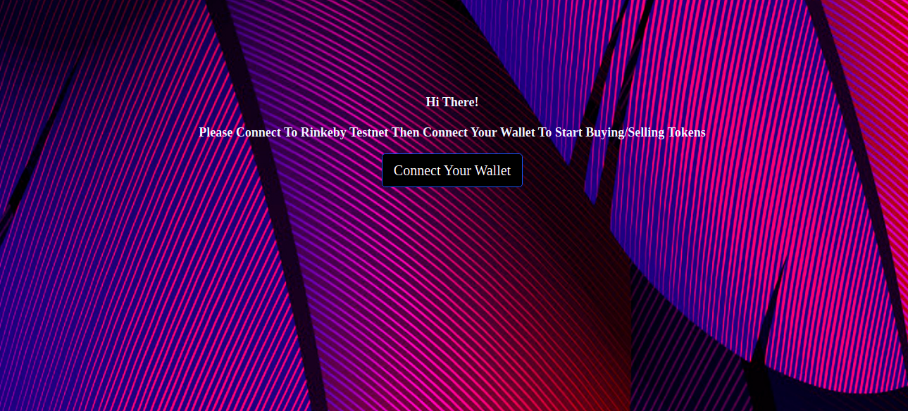
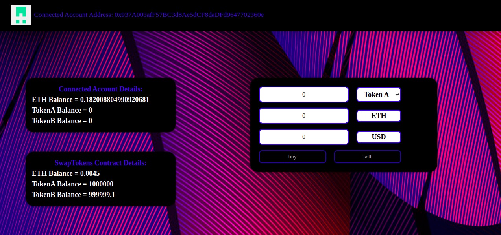

    Connect Metamask       |         Buy/Sell
:-------------------------:|:-------------------------:|
         |         | 

# A simple instant exchange that lets users buy and sell ERC20 tokens:

- This Dapp lets you buy/sell two ERC20 Tokens (TKNA/TKNB) by specifying the (token amount/ETH amount/USD amount).
- Once the Txn is confirmed you can see the update in your account details and in the SwapTokens Contract details.
     (i.e. the change in TKNA balance/TKNB balance/ETH balance)
- Each 1 TKNA = 0.01 ETH.
- Each 1 TKNB = 0.005 ETH.
- The USD price is determined using chainlink's Ethereum Data Feeds on Rinkeby Testnet.
- There are 3 Contracts:
    TokenA, TokenB Contracts: are ERC20 Tokens of initial supply = 1M tokens.
    SwapTokens Contract: has allowance of all tokens and is responsible for letting users buy/sell tokens. (Tokens Pool)

## Deployed Dapp url:
https://mennat1.github.io/ConsensysBootcampDeployedProject/

## Directory structure:
- client: Project's React frontend.
- contracts: Smart contracts that are deployed in Rinkeby testnet.
- migrations: Migration files for deploying contracts in contracts directory.
- test: Tests for smart contracts.

## How to run this project locally:
### Prerequisites:
- Node.js >= v14
- Truffle, Ganache and Metamask
- Npm

### Contracts:
- Run (sudo) npm install in project root to install Truffle build and smart contracts dependencies.
- Make sure Ganache is running.(port 7575)
- truffle console --network development
- Run tests in Truffle console: > test
- Run test from cli using: $truffle test

### Frontend:
- cd client
- (sudo) npm install
- npm start
- Open http://localhost:3000

### Workflow:
- Select TokenA/TokenB.
- Specify (token amount/ETH amount/USD amount).
- Buy -> Confirm Txn / Sell -> Approve Txn -> Confirm Tx.

## Screencast link:
https://www.youtube.com/watch?v=B-2oNYXci3U&ab_channel=MennaAbuelnaga

## Public Ethereum wallet for certification:
0xD8FC00c7fe6e9a12d701192595abF425A6546E9A

